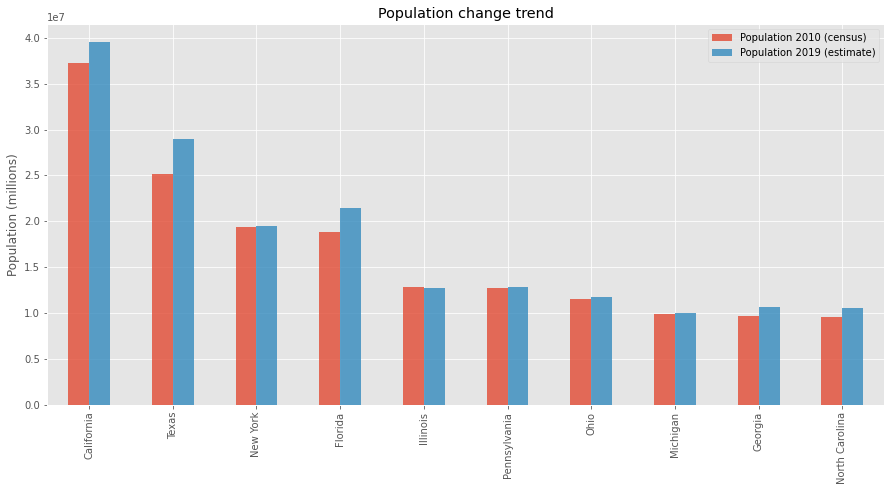
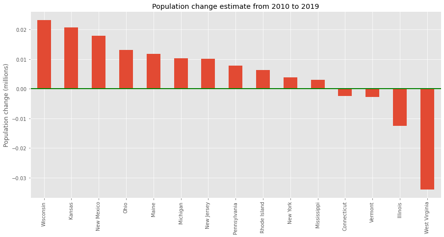

title: Python basics - Pandas
date: 2021-08-14
modified: 2021-08-14
author: Alexey Tereshenkov
tags: python-basics, python, pandas
slug: python-basics-pandas
category: python-basics

[TOC]

This is one of the posts in a series of introductory Python articles. These posts explain programming principles in a simplified way and show very basic Python code that should help folks learning Python to get a better understanding of some concepts. In this post, I'll share some notes about working with a popular data science and data analysis library - `pandas`.

I have simplified this [dataset](https://www2.census.gov/programs-surveys/popest/datasets/2010-2019/counties/totals/co-est2019-alldata.csv) that is part of the Census from this this [portal](https://www.census.gov/data/datasets/time-series/demo/popest/2010s-counties-total.html) to illustrate how `pandas` work.

## Introduction

[`pandas`](http://pandas.pydata.org/) is one of the most popular data analysis and data munging library implemented as a Python package. `pandas` provides an easy-to-use interface for exploring all kinds of datasets. It has hundreds of useful functions and operations, so it is impossible to go through all of them. We will start exploring the basics of `pandas` first by loading a `.csv` file into a `pandas` data frame.


```python
import pandas as pd
pd.set_option('display.max_rows', 7)

df = pd.read_csv('~/data/counties.csv')
df
```


<div>
<style scoped>
    .dataframe tbody tr th:only-of-type {
        vertical-align: middle;
    }

    .dataframe tbody tr th {
        vertical-align: top;
    }

    .dataframe thead th {
        text-align: right;
    }
</style>
<table border="1" class="dataframe">
  <thead>
    <tr style="text-align: right;">
      <th></th>
      <th>STATE</th>
      <th>COUNTY</th>
      <th>POP2010</th>
      <th>EST2010</th>
    </tr>
  </thead>
  <tbody>
    <tr>
      <th>0</th>
      <td>Alabama</td>
      <td>Autauga County</td>
      <td>54571.0</td>
      <td>54597</td>
    </tr>
    <tr>
      <th>1</th>
      <td>Alabama</td>
      <td>Baldwin County</td>
      <td>182265.0</td>
      <td>182265</td>
    </tr>
    <tr>
      <th>2</th>
      <td>Alabama</td>
      <td>Barbour County</td>
      <td>27457.0</td>
      <td>27455</td>
    </tr>
    <tr>
      <th>...</th>
      <td>...</td>
      <td>...</td>
      <td>...</td>
      <td>...</td>
    </tr>
    <tr>
      <th>3139</th>
      <td>Wyoming</td>
      <td>Uinta County</td>
      <td>21118.0</td>
      <td>21121</td>
    </tr>
    <tr>
      <th>3140</th>
      <td>Wyoming</td>
      <td>Washakie County</td>
      <td>8533.0</td>
      <td>8528</td>
    </tr>
    <tr>
      <th>3141</th>
      <td>Wyoming</td>
      <td>Weston County</td>
      <td>7208.0</td>
      <td>7208</td>
    </tr>
  </tbody>
</table>
<p>3142 rows × 4 columns</p>
</div>


Now we would like to create a new `.csv` file with only counties in the Oregon state.


```python
df = pd.read_csv('~/data/counties.csv')
oregon_counties = df[(df.STATE == 'Oregon')]
oregon_counties.to_csv('~/data/oregon.csv', index=False)

pd.read_csv('~/data/oregon.csv')
```


<div>
<style scoped>
    .dataframe tbody tr th:only-of-type {
        vertical-align: middle;
    }

    .dataframe tbody tr th {
        vertical-align: top;
    }

    .dataframe thead th {
        text-align: right;
    }
</style>
<table border="1" class="dataframe">
  <thead>
    <tr style="text-align: right;">
      <th></th>
      <th>STATE</th>
      <th>COUNTY</th>
      <th>POP2010</th>
      <th>EST2010</th>
    </tr>
  </thead>
  <tbody>
    <tr>
      <th>0</th>
      <td>Oregon</td>
      <td>Baker County</td>
      <td>16134.0</td>
      <td>16131</td>
    </tr>
    <tr>
      <th>1</th>
      <td>Oregon</td>
      <td>Benton County</td>
      <td>85579.0</td>
      <td>85581</td>
    </tr>
    <tr>
      <th>2</th>
      <td>Oregon</td>
      <td>Clackamas County</td>
      <td>375992.0</td>
      <td>375996</td>
    </tr>
    <tr>
      <th>...</th>
      <td>...</td>
      <td>...</td>
      <td>...</td>
      <td>...</td>
    </tr>
    <tr>
      <th>33</th>
      <td>Oregon</td>
      <td>Washington County</td>
      <td>529710.0</td>
      <td>529862</td>
    </tr>
    <tr>
      <th>34</th>
      <td>Oregon</td>
      <td>Wheeler County</td>
      <td>1441.0</td>
      <td>1439</td>
    </tr>
    <tr>
      <th>35</th>
      <td>Oregon</td>
      <td>Yamhill County</td>
      <td>99193.0</td>
      <td>99216</td>
    </tr>
  </tbody>
</table>
<p>36 rows × 4 columns</p>
</div>


This kind of operations and many others that you will learn now can be done using any RDBMS such SQL Server, MySQL, or PostgreSQL or an office program such as Excel. However, not all of your data will originate or be stored in a RDBMS. We could load `.csv` files into a RDBMS to do this kind of work, but if there is no need to manage the data over time in the database, we may use the wrong tool for the job.

## Basic operations

As you see, it is very easy to load external data into something that is called a `DataFrame`. You can think of this as a relational table that consists of rows and columns. This is what you would expect to have after importing a `.csv` file into an Excel sheet. Let's explore some of the basic operations that are available for a `DataFrame` object:


```python
# getting only the first 5 rows, equivalent to df[0:5]
df.head()
```


<div>
<style scoped>
    .dataframe tbody tr th:only-of-type {
        vertical-align: middle;
    }

    .dataframe tbody tr th {
        vertical-align: top;
    }

    .dataframe thead th {
        text-align: right;
    }
</style>
<table border="1" class="dataframe">
  <thead>
    <tr style="text-align: right;">
      <th></th>
      <th>STATE</th>
      <th>COUNTY</th>
      <th>POP2010</th>
      <th>EST2010</th>
    </tr>
  </thead>
  <tbody>
    <tr>
      <th>0</th>
      <td>Alabama</td>
      <td>Autauga County</td>
      <td>54571.0</td>
      <td>54597</td>
    </tr>
    <tr>
      <th>1</th>
      <td>Alabama</td>
      <td>Baldwin County</td>
      <td>182265.0</td>
      <td>182265</td>
    </tr>
    <tr>
      <th>2</th>
      <td>Alabama</td>
      <td>Barbour County</td>
      <td>27457.0</td>
      <td>27455</td>
    </tr>
    <tr>
      <th>3</th>
      <td>Alabama</td>
      <td>Bibb County</td>
      <td>22915.0</td>
      <td>22915</td>
    </tr>
    <tr>
      <th>4</th>
      <td>Alabama</td>
      <td>Blount County</td>
      <td>57322.0</td>
      <td>57322</td>
    </tr>
  </tbody>
</table>
</div>


```python
# sort in-place to get most populated counties
df.sort_values('POP2010', ascending=False, inplace=True)
df.head()
```


<div>
<style scoped>
    .dataframe tbody tr th:only-of-type {
        vertical-align: middle;
    }

    .dataframe tbody tr th {
        vertical-align: top;
    }

    .dataframe thead th {
        text-align: right;
    }
</style>
<table border="1" class="dataframe">
  <thead>
    <tr style="text-align: right;">
      <th></th>
      <th>STATE</th>
      <th>COUNTY</th>
      <th>POP2010</th>
      <th>EST2010</th>
    </tr>
  </thead>
  <tbody>
    <tr>
      <th>204</th>
      <td>California</td>
      <td>Los Angeles County</td>
      <td>9818605.0</td>
      <td>9819968</td>
    </tr>
    <tr>
      <th>610</th>
      <td>Illinois</td>
      <td>Cook County</td>
      <td>5194675.0</td>
      <td>5195026</td>
    </tr>
    <tr>
      <th>2623</th>
      <td>Texas</td>
      <td>Harris County</td>
      <td>4092459.0</td>
      <td>4093176</td>
    </tr>
    <tr>
      <th>103</th>
      <td>Arizona</td>
      <td>Maricopa County</td>
      <td>3817117.0</td>
      <td>3817365</td>
    </tr>
    <tr>
      <th>222</th>
      <td>California</td>
      <td>San Diego County</td>
      <td>3095313.0</td>
      <td>3095349</td>
    </tr>
  </tbody>
</table>
</div>


```python
# filter by condition, show only counties in California state
df[df.STATE == 'California']
```


<div>
<style scoped>
    .dataframe tbody tr th:only-of-type {
        vertical-align: middle;
    }

    .dataframe tbody tr th {
        vertical-align: top;
    }

    .dataframe thead th {
        text-align: right;
    }
</style>
<table border="1" class="dataframe">
  <thead>
    <tr style="text-align: right;">
      <th></th>
      <th>STATE</th>
      <th>COUNTY</th>
      <th>POP2010</th>
      <th>EST2010</th>
    </tr>
  </thead>
  <tbody>
    <tr>
      <th>204</th>
      <td>California</td>
      <td>Los Angeles County</td>
      <td>9818605.0</td>
      <td>9819968</td>
    </tr>
    <tr>
      <th>222</th>
      <td>California</td>
      <td>San Diego County</td>
      <td>3095313.0</td>
      <td>3095349</td>
    </tr>
    <tr>
      <th>215</th>
      <td>California</td>
      <td>Orange County</td>
      <td>3010232.0</td>
      <td>3008989</td>
    </tr>
    <tr>
      <th>...</th>
      <td>...</td>
      <td>...</td>
      <td>...</td>
      <td>...</td>
    </tr>
    <tr>
      <th>210</th>
      <td>California</td>
      <td>Modoc County</td>
      <td>9686.0</td>
      <td>9682</td>
    </tr>
    <tr>
      <th>231</th>
      <td>California</td>
      <td>Sierra County</td>
      <td>3240.0</td>
      <td>3239</td>
    </tr>
    <tr>
      <th>187</th>
      <td>California</td>
      <td>Alpine County</td>
      <td>1175.0</td>
      <td>1175</td>
    </tr>
  </tbody>
</table>
<p>58 rows × 4 columns</p>
</div>


```python
# show rows with missing values for POP2010 column
df[df.POP2010.isnull()]
```


<div>
<style scoped>
    .dataframe tbody tr th:only-of-type {
        vertical-align: middle;
    }

    .dataframe tbody tr th {
        vertical-align: top;
    }

    .dataframe thead th {
        text-align: right;
    }
</style>
<table border="1" class="dataframe">
  <thead>
    <tr style="text-align: right;">
      <th></th>
      <th>STATE</th>
      <th>COUNTY</th>
      <th>POP2010</th>
      <th>EST2010</th>
    </tr>
  </thead>
  <tbody>
    <tr>
      <th>9</th>
      <td>Alabama</td>
      <td>Cherokee County</td>
      <td>NaN</td>
      <td>25979</td>
    </tr>
  </tbody>
</table>
</div>


```python
# show only counties within the two states and sort by state and then by population
df[df.STATE.isin(['Delaware', 'Texas'])].sort_values(
    ['STATE', 'POP2010'], ascending=[True, False])[:10]
```


<div>
<style scoped>
    .dataframe tbody tr th:only-of-type {
        vertical-align: middle;
    }

    .dataframe tbody tr th {
        vertical-align: top;
    }

    .dataframe thead th {
        text-align: right;
    }
</style>
<table border="1" class="dataframe">
  <thead>
    <tr style="text-align: right;">
      <th></th>
      <th>STATE</th>
      <th>COUNTY</th>
      <th>POP2010</th>
      <th>EST2010</th>
    </tr>
  </thead>
  <tbody>
    <tr>
      <th>317</th>
      <td>Delaware</td>
      <td>New Castle County</td>
      <td>538479.0</td>
      <td>538484</td>
    </tr>
    <tr>
      <th>318</th>
      <td>Delaware</td>
      <td>Sussex County</td>
      <td>197145.0</td>
      <td>197103</td>
    </tr>
    <tr>
      <th>316</th>
      <td>Delaware</td>
      <td>Kent County</td>
      <td>162310.0</td>
      <td>162350</td>
    </tr>
    <tr>
      <th>...</th>
      <td>...</td>
      <td>...</td>
      <td>...</td>
      <td>...</td>
    </tr>
    <tr>
      <th>2749</th>
      <td>Texas</td>
      <td>Travis County</td>
      <td>1024266.0</td>
      <td>1024444</td>
    </tr>
    <tr>
      <th>2593</th>
      <td>Texas</td>
      <td>El Paso County</td>
      <td>800647.0</td>
      <td>800633</td>
    </tr>
    <tr>
      <th>2565</th>
      <td>Texas</td>
      <td>Collin County</td>
      <td>782341.0</td>
      <td>781419</td>
    </tr>
  </tbody>
</table>
<p>10 rows × 4 columns</p>
</div>


```python
# getting total population for all counties in a state
df.POP2010[df.STATE == 'Texas'].sum()
```


    25145561.0


```python
# get number of counties within each state
df.STATE.value_counts()
```


    Texas                   254
    Georgia                 159
    Virginia                133
                           ... 
    Hawaii                    5
    Delaware                  3
    District of Columbia      1
    Name: STATE, Length: 51, dtype: int64


```python
# sum population of counties within a state; 
# list sorted by population (omitting all other columns for brevity)
res = df[['STATE', 'POP2010']].groupby('STATE').sum()
res.sort_values('POP2010', ascending=False)
```


<div>
<style scoped>
    .dataframe tbody tr th:only-of-type {
        vertical-align: middle;
    }

    .dataframe tbody tr th {
        vertical-align: top;
    }

    .dataframe thead th {
        text-align: right;
    }
</style>
<table border="1" class="dataframe">
  <thead>
    <tr style="text-align: right;">
      <th></th>
      <th>POP2010</th>
    </tr>
    <tr>
      <th>STATE</th>
      <th></th>
    </tr>
  </thead>
  <tbody>
    <tr>
      <th>California</th>
      <td>37253956.0</td>
    </tr>
    <tr>
      <th>Texas</th>
      <td>25145561.0</td>
    </tr>
    <tr>
      <th>New York</th>
      <td>19378102.0</td>
    </tr>
    <tr>
      <th>...</th>
      <td>...</td>
    </tr>
    <tr>
      <th>Vermont</th>
      <td>625741.0</td>
    </tr>
    <tr>
      <th>District of Columbia</th>
      <td>601723.0</td>
    </tr>
    <tr>
      <th>Wyoming</th>
      <td>563626.0</td>
    </tr>
  </tbody>
</table>
<p>51 rows × 1 columns</p>
</div>


`pandas` has a concept of [boolean indexing](http://pandas.pydata.org/pandas-docs/stable/indexing.html#boolean-indexing) which provides powerful techniques for selecting rows using functions and various criteria. In the example below, each item in the `bool_index` list variable is either `True` or `False` depending on whether an item in the column `STATE` when passed into the `startswith()` function returned `True` or `False`. This list is used then to select rows in `df` - those rows for which there is `True` in the `bool_index` will be returned.

Here we return those counties with population larger than a certain value which are in a state with the name of the state starting with `W`.


```python
bool_index = [x.startswith('W') for x in df['STATE']] 
df[(df['POP2010'] < 6000) & bool_index]
```


<div>
<style scoped>
    .dataframe tbody tr th:only-of-type {
        vertical-align: middle;
    }

    .dataframe tbody tr th {
        vertical-align: top;
    }

    .dataframe thead th {
        text-align: right;
    }
</style>
<table border="1" class="dataframe">
  <thead>
    <tr style="text-align: right;">
      <th></th>
      <th>STATE</th>
      <th>COUNTY</th>
      <th>POP2010</th>
      <th>EST2010</th>
    </tr>
  </thead>
  <tbody>
    <tr>
      <th>3072</th>
      <td>Wisconsin</td>
      <td>Iron County</td>
      <td>5916.0</td>
      <td>5916</td>
    </tr>
    <tr>
      <th>3044</th>
      <td>West Virginia</td>
      <td>Wirt County</td>
      <td>5717.0</td>
      <td>5714</td>
    </tr>
    <tr>
      <th>3127</th>
      <td>Wyoming</td>
      <td>Hot Springs County</td>
      <td>4812.0</td>
      <td>4812</td>
    </tr>
    <tr>
      <th>...</th>
      <td>...</td>
      <td>...</td>
      <td>...</td>
      <td>...</td>
    </tr>
    <tr>
      <th>2987</th>
      <td>Washington</td>
      <td>Wahkiakum County</td>
      <td>3978.0</td>
      <td>3979</td>
    </tr>
    <tr>
      <th>3132</th>
      <td>Wyoming</td>
      <td>Niobrara County</td>
      <td>2484.0</td>
      <td>2484</td>
    </tr>
    <tr>
      <th>2964</th>
      <td>Washington</td>
      <td>Garfield County</td>
      <td>2266.0</td>
      <td>2266</td>
    </tr>
  </tbody>
</table>
<p>9 rows × 4 columns</p>
</div>


As you have seen, with `pandas` it is very easy to get useful insights about the data and do some data filtering, sorting, and SQL like selections. What would require many lines of code in plain Python (using `collections.Counter`, creating intermediate data structures, and copies of data) could be done in just one line in `pandas`. Using this package can make you a more productive developer or an analyst. It can also simply be very handy to be able to clean the data as needed when using a graphical user interface isn't very convenient.

## Plotting

`pandas` is able to load data from all kinds of sources such as `csv`, `Excel`, `HTML`, and `SQL` databases.
However, it is also possible to construct a `DataFrame` from all kinds of Python data structures such as dictionaries, lists, and tuples as well as from `numpy` arrays. This means that if any existing program already creates such a data structure, it's very likely that you'll be able to construct a `DataFrame` from it.

`pandas` also has built-in [plotting functions](http://pandas.pydata.org/pandas-docs/stable/visualization.html#visualization) which use [`matplotlib`](http://matplotlib.org/) features - one of the popular Python plotting libraries.


```python
%matplotlib inline
import matplotlib.pyplot as plt
plt.style.use('ggplot')
```


```python
df = pd.read_csv('~/data/states.csv')
df.sort_values('POP2010', ascending=False, inplace=True)
fig = df[['STATE', 'POP2010', 'EST2019']].head(10).plot(
    kind='bar', x='STATE', alpha=0.8, legend=True, figsize=(15, 7),
    title="Population change trend")
fig.legend(['Population 2010 (census)', 'Population 2019 (estimate)'])
fig.set_xlabel('')
fig.set_ylabel('Population (millions)')
```


    Text(0, 0.5, 'Population (millions)')



    


```python
df['POPDIFF'] = (df['EST2019'] - df['POP2010']) / df['EST2019']
df.sort_values('POPDIFF', ascending=False, inplace=True)
fig = df[['STATE', 'POPDIFF']].tail(15).plot(
    kind='bar', x='STATE', figsize=(15, 7), legend=None,
    title='Population change estimate from 2010 to 2019')

fig.set_xlabel('')
fig.set_ylabel('Population change (millions)')
fig.axhline(linewidth=2, color='g')
```


    



As you can see it is relatively easy to plot images with `pandas` and `matplotlib`. There are so many other options and graph types to choose from; you may explore more of those on the [`matplotlib` home page](http://matplotlib.org/gallery.html).

Happy analyzing!
