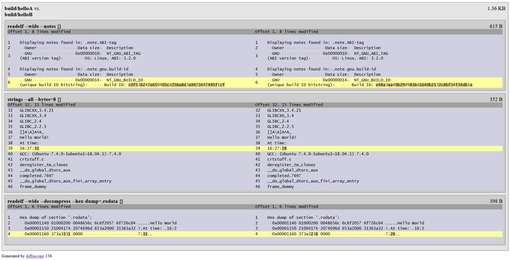

title: Brief overview of the reproducible builds concept
date: 2020-08-21
modified: 2020-08-21
author: Alexey Tereshenkov
tags: build-systems,continuous-integration
slug: intro-reproducible-builds
category: build-systems

### Introduction

When working with the source code in a project that has multiple build steps 
(compiling, linking, patching, packaging) when a final "product" -- a Debian package,
an installable application, or an executable with shared libraries -- is produced,
there are many reasons why it can be useful to be able to get the same binary code
(bit-by-bit) from the same source code.

If you are able to build your project source code and then re-build it again later
(without making any changes to the source code) and the produced artifacts are identical,
it is said that your builds are [reproducible/deterministic](https://en.wikipedia.org/wiki/Reproducible_builds).

### How can one set up a reproducible build?

According to the [https://reproducible-builds.org](https://reproducible-builds.org/docs/definition/) definition:

> A build is reproducible if given the same source code, build environment and build instructions, 
any party can recreate bit-by-bit identical copies of all specified artifacts.

For a simple project with a small number of movings parts, it may be relatively easy to achieve 
reproducible builds whereas for a corporate software development project this can be a challenge.
There are multiple reasons why the binaries produced by a build operation may differ between
builds run from the same source code.

There are a few resources that will help you get started:

* [An introduction to deterministic builds with C/C++](https://blog.conan.io/2019/09/02/Deterministic-builds-with-C-C++.html) provides a gentle introduction to the concept and its importance and benefits
* [Reproducible builds](https://reproducible-builds.org/) will help you learn more about software development practices
around the reproducible builds.

### Elements of indeterminism

Two most common issues are timestamps (when the source code is built) 
which may be saved into the produced binaries
and path information (the location of the source code files on disk) 
which can also be included into the output binaries. 
However, many other things can have impact and make two binaries different
(they may have the same size, but still be different when doing bit-by-bit comparison).

Some of the things you will have control from the build system tools perspective such
as compilers and linkers.
For instance, you can control the order in which files are being processed as 
file systems generally do not make any promises that when you iterate
the files in a given directory, they will be retrieved in the same order at all times.
Other things may be defined in your custom post-processing logic -- for instance, the order in which you
set certain properties on a binary (such as `RPATH` patching) can also result in two different
binaries.

### Sample project

I have created a GitHub repository with the source code files that have been used in the Conan
article [An introduction to deterministic builds with C/C++](https://blog.conan.io/2019/09/02/Deterministic-builds-with-C-C++.html) and it is available at [reproducible-builds-example](https://github.com/AlexTereshenkov/reproducible-builds-example).
This example project demonstrates the concept of reproducible builds with a few C++ source files and CMake build steps.

A great tool that will help you compare the binaries in your effort to achieve reproducible builds 
is [Diffoscope](https://diffoscope.org/).
It is extremely powerful and has functionality for generating HTML reports showing
the difference between two objects you are comparing.
This makes it so much easier to see why your binaries are different.
Below is a screenshot of the HTML report that shows the difference between two executables.

Happy diffing!